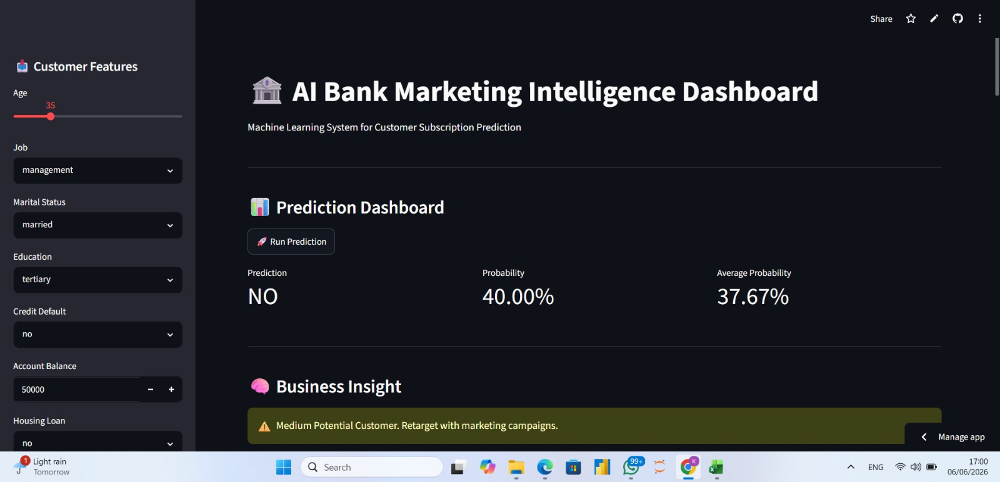

# 🏦 AI Bank Marketing Intelligence Dashboard

An end to end Machine Learning application built with Streamlit for predicting customer subscription likelihood in a bank marketing campaign.

## 🚀 Live Demo

**Application URL**

https://bank-ai-ml-system-e2p7ak9ydjvcp7wcd7x8sr.streamlit.app/

## 📌 Project Overview

This project leverages Machine Learning to predict whether a customer is likely to subscribe to a bank term deposit based on demographic, financial, and marketing campaign attributes.

The application provides:

* Real time customer subscription prediction
* Probability scoring
* Business insights and recommendations
* Customer segmentation
* Feature importance visualization
* Analytics dashboard
* Downloadable prediction reports

## 🛠️ Technologies Used

* Python
* Streamlit
* Scikit Learn
* Pandas
* Matplotlib
* Joblib

## 📊 Features

* Interactive prediction interface
* Customer profiling dashboard
* Machine Learning powered decision support
* Prediction confidence scoring
* Feature importance analysis
* Historical prediction analytics
* CSV report export

## 📂 Input Features

* Age
* Job
* Marital Status
* Education
* Credit Default
* Account Balance
* Housing Loan
* Personal Loan
* Contact Type
* Day of Contact
* Month
* Call Duration
* Campaign Contacts
* Previous Contact Days
* Previous Contacts
* Previous Campaign Outcome

## 🎯 Business Value

The system helps marketing teams:

* Identify high value prospects
* Prioritize customer outreach
* Improve campaign efficiency
* Increase subscription conversion rates
* Support data driven marketing decisions

## 👨‍💻 Developer

**Adepoju Ibrahim Isola**

Data Scientist | Data Analyst | AI Automation Specialist

## ⭐ Live Application

https://bank-ai-ml-system-e2p7ak9ydjvcp7wcd7x8sr.streamlit.app/

## Application Preview

